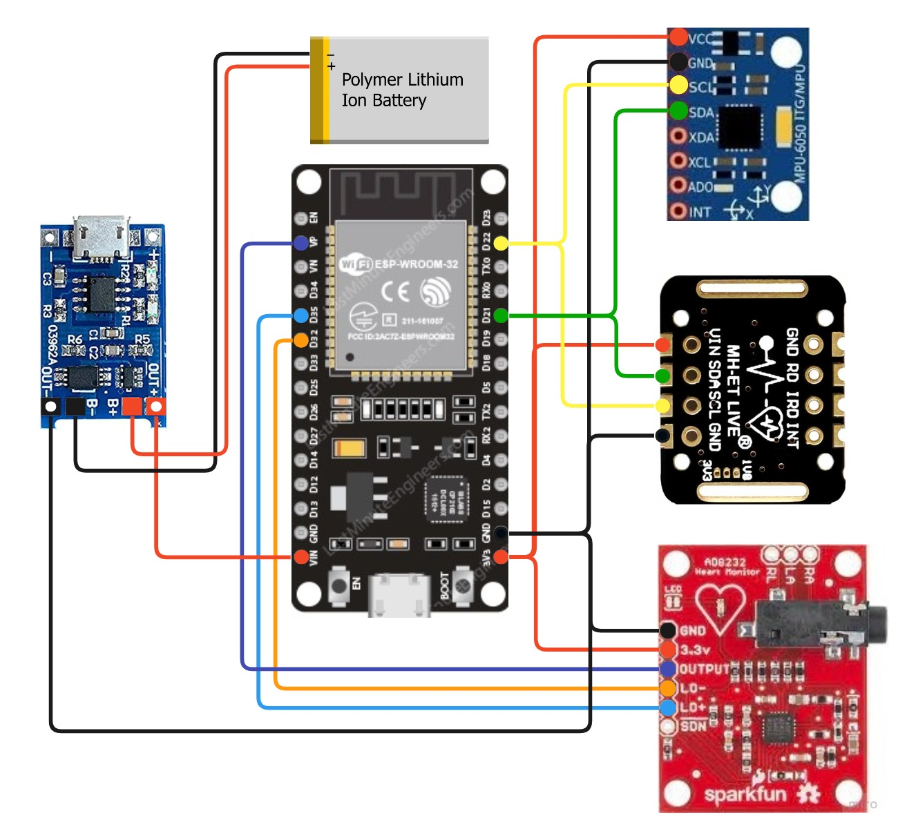

# EyeECG

## Introduction 
Hello Everyone, We are Habeba Ahmed and Shomoa Mohamed.
We are Computer Engineering Students from Mansoura University in Egypt, and we would love to share our graduation project with you.
This is part of our graduation project, which predicts myocardial infarction using retinal scans. 
This project concentrates on collecting data to send to a mobile application with an AI Model that predicts myocardial Infarction (Heart Attack) using Demographic data, such as Heart rate, Spo2, blood pressure, and user posture.

## Dell Envision The Future Compition
We are so proud that our team of 7 members is the First-place winner in the Dell Envision the Future competition in 2023.
https://www.dell.com/en-ae/dt/campaigns/ecs-internet-things/envision-the-future/winners.htm#tab0=0

## Hardware 

The hardware components of the system are selected strategically to enable the measurement of blood pressure and provide comprehensive cardiovascular health monitoring. These components include:

1. Esp32: The Esp32 serves as the main processing unit in the system. It is chosen for its powerful capabilities in IoT applications and its suitability for wearable devices. The Esp32 integrates Wi-Fi and Bluetooth Low Energy (BLE) connectivity options, allowing seamless communication and data transfer between the wearable device and other devices or cloud platforms. Its processing power and memory capacity enable efficient data processing and analysis.

2. Max30102: the MAX30102 sensor module utilizes the principle of light absorption by blood to estimate blood oxygen saturation and heart rate. It combines two LEDs (red and infrared) and a photodetector to capture the amount of light absorbed by the blood.

Here's how the MAX30102 works:

1. Light Emission: The module emits red and infrared light from the LEDs into the tissue, usually through a finger or earlobe.

2. Light Absorption: The emitted light penetrates the skin and reaches the blood vessels. Oxygenated blood absorbs more infrared light, while deoxygenated blood absorbs more red light. The photodetector within the module measures the intensity of the light that passes through the tissue.
3. Photodetector Measurement: The photodetector captures the amount of light that is transmitted through the tissue. It converts the light intensity into an electrical signal, which is then processed by the module.

4. Signal Processing: The MAX30102 module applies sophisticated algorithms to filter out noise and artifacts from the measured signal. It analyzes the intensity of the red and infrared light to calculate the ratio of oxygenated hemoglobin to total hemoglobin, known as the SpO2 (blood oxygen saturation) level.

5. Heart Rate Calculation: Additionally, the module uses variations in the intensity of the detected light to determine the user's heart rate. It measures the time intervals between peaks in the photodetector signal to calculate the beats per minute (BPM).

6. Data Output: The MAX30102 provides the calculated SpO2 level and heart rate as a digital output, which can be read and processed by a microcontroller or other devices.

3. MPU6050: The MPU6050 sensor plays a crucial role in the functionality of the wearable band. It is a motion-tracking device that combines a 3-axis accelerometer and a 3-axis gyroscope. The sensor detects changes in motion and orientation, allowing the system to determine the user's activity levels and motion patterns. For instance, when a user interacts with the band by pressing a button or performing a specific gesture, the MPU6050 sensor detects the motion and triggers the corresponding mode or action in the system. This feature ensures user safety and enhances the overall user experience.

4. AD8232: The AD8232 integrated circuit is specifically designed for measuring the ECG. It amplifies and filters the electrical signals generated by the heart's activity, making them suitable for accurate analysis. The AD8232 features an instrumentation amplifier that amplifies the weak ECG signals acquired from electrodes placed on the body. It also incorporates a built-in filter that removes noise and interference, ensuring the fidelity of the ECG measurements. Additionally, the AD8232 includes a right-leg drive circuit that reduces common-mode interference. The output from the AD8232 is a conditioned ECG signal, which can be further processed or analyzed to monitor the cardiac activity of the wearer.
   The software components of the system are developed using the PlatformIO development platform. PlatformIO is a professional and cross-platform development environment for embedded systems. It provides a unified interface for coding, debugging, and deploying applications on various microcontrollers, including the Esp32.
The software development process involves writing code for each individual sensor and integrating them into a cohesive system. The code for the Esp32 enables seamless communication between the sensors and facilitates data exchange with other devices or cloud platforms. The code for the Max30100 sensor interprets the light absorption data and calculates the blood oxygen saturation level. The code for the MPU6050 sensor processes the motion and orientation data to determine the user's activity levels. Lastly, the code for the AD8232 sensor amplifies and filters the ECG signals, ensuring accurate measurement of cardiac activity.
The PlatformIO development platform and the software components are utilized to ensure smooth operation and synchronization between the hardware components. This comprehensive approach enables reliable ECG measurements, blood oxygen level monitoring, and activity tracking, contributing to a comprehensive cardiovascular health monitoring system.

## Communication:

Bluetooth Low Energy (BLE) is a wireless communication technology designed for short-range, low-power applications. It operates on the same frequency band as classic Bluetooth but consumes significantly less power, making it ideal for battery-powered devices and Internet of Things (IoT) applications.
BLE uses a client-server architecture, where one device acts as the central device (the server) and other devices act as peripheral devices (the clients). The central device initiates communication and manages the connection with peripheral devices.
BLE communication is based on a concept called Generic Attribute Profile (GATT), which defines a set of rules and protocols for data exchange. GATT organizes data into a hierarchical structure using attributes, which can be read, written, or notified/indicated. Each attribute has a unique identifier called a Universally Unique Identifier (UUID).

 ### BLE Protocol Architecture:

#### GATT:

BLE devices communicate using small packets of data called advertisements. These advertisements contain information about the device, such as its name, services offered, and available data. Peripheral devices periodically broadcast advertisements, allowing central devices to discover and establish connections with them.
Once a connection is established, data exchange between the central and peripheral devices occurs through GATT transactions. The central device can read or write data to the attributes exposed by the peripheral device. Notifications and indications can also be used to enable real-time data streaming from the peripheral device to the central device.

